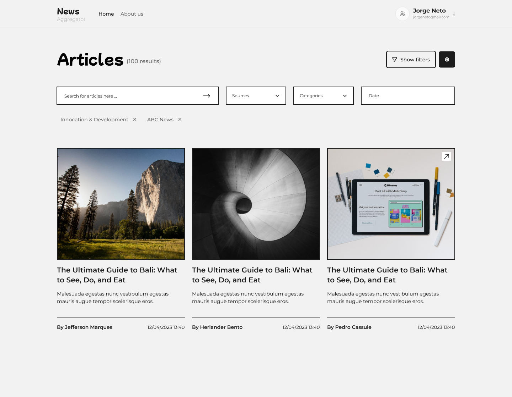

# 📰 News Aggregator

Welcome to **News Aggregator**, your number one source for the latest news articles from around the world. We're dedicated to providing you the best of news, with a focus on reliability, accessibility, and comprehensiveness.

---



## 🚀 Features

### Completed Features
- **List Articles**: Fetch and display articles from an API using `react-query`.
- **Filter Articles**: Enable users to filter articles dynamically using `URL state` with `react-router-dom`.
- **Configurable Filters**: Customize filters for enhanced user experience.
- **User-Friendly Interface**: Modern and intuitive design for seamless navigation.
- **Article Details**: View detailed information about each article.
- **Responsive Design**: Optimized layout for desktops, tablets, and mobile devices.

### Upcoming Features
- **Newsletter Subscription**: Allow users to subscribe to a newsletter for updates.
- **GitHub Authentication**: Log in using GitHub for a personalized experience.
- **Authentication**: Implement user authentication for added functionality.

---

## 🛠️ Technologies Used

| Technology         | Description                                          | Icon                                                                                      |
|---------------------|------------------------------------------------------|------------------------------------------------------------------------------------------|
| **React.js**       | JavaScript library for building user interfaces.     |                |
| **TypeScript**     | Typed superset of JavaScript for scalable development. | |
| **React Query**    | Data fetching and caching library for React apps.     | |
| **React Router**   | Declarative routing for React applications.           | |
| **Firebase**       | Backend platform for authentication and storage.      |        |

---

## 📖 Getting Started

Follow these steps to get the project up and running on your local machine:

1. Clone the repository:
   ```bash
   git clone https://github.com/Adao-Angelo/news-aggregations.git
   ```

2. Navigate to the project directory:
   ```bash
   cd news-aggregations
   ```

3. Install dependencies:
   ```bash
   npm install
   ```

4. Start the development server:
   ```bash
   npm start
   ```

5. Open your browser and navigate to:
   ```
   http://localhost:5173
   ```

---
## 📧 .env 

[env docs](./docs/env.md)

## 📧 Contact

For questions or feedback, feel free to reach out:

- **Email**: adaobbegginer@gmail.com
- **GitHub**: [Adão Ângelo Joâo](https://github.com/Adao-Angelo)
-
---

Thank you for using **News Aggregator**! Stay informed and enjoy your reading experience.


